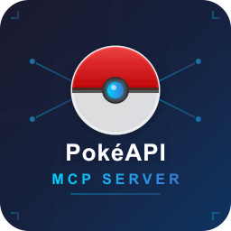

<p align="center">
  
</p>

<h1 align="center">PokéAPI MCP Server — VS Code Extension</h1>

<p align="center">
  <strong>Brings the full Pokémon universe to your AI assistant inside VS Code</strong>
</p>

<p align="center">
  <a href="https://marketplace.visualstudio.com/items?itemName=bhayanak.pokeapi-mcp-extension"></a>
  <a href="https://github.com/bhayanak/pokemon-mcp-server/blob/main/LICENSE"></a>
  
  
</p>

---

## What It Does

This extension registers a **PokéAPI MCP server** directly in VS Code's MCP infrastructure. Your AI assistant (GitHub Copilot, Claude, etc.) gets access to **12 Pokémon data tools** — no manual server management needed.

VS Code automatically provides **start / stop / restart / show config / show output** controls for the server.

## Features

- **Zero configuration** — works out of the box with sensible defaults
- **Auto-managed lifecycle** — VS Code starts/stops the server automatically
- **Full PokéAPI coverage** — 1300+ species, 900+ moves, 300+ abilities, 18 types
- **Smart caching** — 24-hour LRU cache (PokéAPI data is static)
- **Configurable** — all settings available in VS Code Settings UI

## Installation

### From Marketplace

Search for **"PokéAPI MCP Server"** in the VS Code Extensions panel.

### From VSIX

```bash
code --install-extension pokeapi-mcp-extension-0.1.0.vsix
```

## Tools Provided

Once installed, your AI assistant can use these tools:

| Tool | Description |
|------|-------------|
| `pokemon_get` | Get detailed Pokémon info by name/ID |
| `pokemon_search` | Search Pokémon by type, generation, or ability |
| `pokemon_get_type` | Get type details and damage relations |
| `pokemon_type_matchup` | Calculate type effectiveness (dual-type support) |
| `pokemon_get_move` | Get move details (power, accuracy, effects) |
| `pokemon_search_moves` | Search moves by type, category, or power range |
| `pokemon_get_ability` | Get ability details and Pokémon with that ability |
| `pokemon_get_evolution_chain` | Full evolution tree with conditions |
| `pokemon_get_species` | Species data (flavor text, habitat, egg groups) |
| `pokemon_get_item` | Get item details (effect, category, cost) |
| `pokemon_compare` | Compare 2–4 Pokémon side-by-side |
| `pokemon_type_coverage` | Analyze team type coverage and weaknesses |

## Configuration

All settings are available in **Settings > Extensions > PokéAPI MCP Server**:

| Setting | Default | Description |
|---------|---------|-------------|
| `pokeapiMcp.baseUrl` | `https://pokeapi.co/api/v2` | PokéAPI base URL |
| `pokeapiMcp.cacheTtlMs` | `86400000` (24h) | Cache TTL in milliseconds |
| `pokeapiMcp.cacheMaxSize` | `500` | Max LRU cache entries |
| `pokeapiMcp.timeoutMs` | `10000` | HTTP request timeout (ms) |
| `pokeapiMcp.language` | `en` | Language for names/descriptions |

After changing settings, restart the MCP server from the VS Code MCP servers panel.

## Requirements

- VS Code ≥ 1.99.0
- Node.js ≥ 18 (VS Code's bundled Node.js is used automatically)

## License

[MIT](../../LICENSE) © bhayanak
